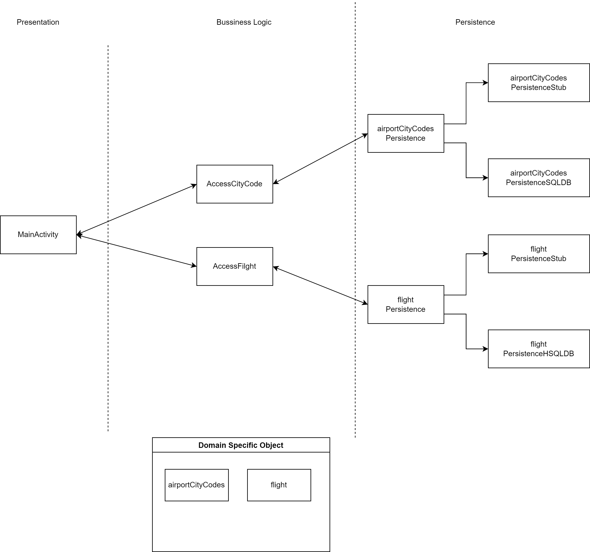

# Architecture Diagram

## Iteration 2 Diagram

  
  

## Iteration 1 Diagram

  

## Presentation Layer

[MainActivity](https://code.cs.umanitoba.ca/winter-2022-a01/group-4/team-flight-4/-/blob/development/flight/app/src/main/java/com/flight/presentation/MainActivity.java)

This file contains the UI layout that user enters TRIPTYPE, DEPATURE and ARRIVAL CITY, DATES OF TRAVEL, and the number of travllers either adults or children or both. Once enter also click SEARCH button.

[RecFlightsActivity](https://code.cs.umanitoba.ca/winter-2022-a01/group-4/team-flight-4/-/blob/development/flight/app/src/main/java/com/flight/presentation/RecFlightsActivity.java)

This file open a new flight activity containing travellers flight options and adds ability to reserve a certain flight.

## Business Logic Layer

[AccessCityCode](https://code.cs.umanitoba.ca/winter-2022-a01/group-4/team-flight-4/-/blob/development/flight/app/src/main/java/com/flight/business/AccessCityCode.java)

This class is for getting the city name and code from the database.

[FlightTable](https://code.cs.umanitoba.ca/winter-2022-a01/group-4/team-flight-4/-/blob/development/flight/app/src/main/java/com/flight/business/FlightTable.java)

This class is for getting a flight table.

[FlightInfo](https://code.cs.umanitoba.ca/winter-2022-a01/group-4/team-flight-4/-/blob/development/flight/app/src/main/java/com/flight/business/FlightsInfo.java)

This class is to define what info is in the flight.

[SearchHandler](https://code.cs.umanitoba.ca/winter-2022-a01/group-4/team-flight-4/-/blob/development/flight/app/src/main/java/com/flight/business/SearchHandler.java)

This class is a handler for presentation layer to search flights with specific conditions.

## Application Layer

[Services](https://code.cs.umanitoba.ca/winter-2022-a01/group-4/team-flight-4/-/blob/development/flight/app/src/main/java/com/flight/application/Services.java)

This class is to deal with the persistence layer for AccessCityCode and SearchHandler.

## Persistence Layer

[CityCode](https://code.cs.umanitoba.ca/winter-2022-a01/group-4/team-flight-4/-/blob/development/flight/app/src/main/java/com/flight/persistence/CityCode.java)

This class is to define what info is in the citycode.

[CityCodesArray](https://code.cs.umanitoba.ca/winter-2022-a01/group-4/team-flight-4/-/blob/development/flight/app/src/main/java/com/flight/persistence/CityCodesArray.java)

This class is to define a citycode array in the fake database.

[FakeDB](https://code.cs.umanitoba.ca/winter-2022-a01/group-4/team-flight-4/-/blob/development/flight/app/src/main/java/com/flight/persistence/FakeDB.java)

This class is to define a fake database for citycodes.

[Flight](https://code.cs.umanitoba.ca/winter-2022-a01/group-4/team-flight-4/-/blob/development/flight/app/src/main/java/com/flight/persistence/Flight.java)

This class is to define what info is in the flight.

[FlightHandler](https://code.cs.umanitoba.ca/winter-2022-a01/group-4/team-flight-4/-/blob/development/flight/app/src/main/java/com/flight/persistence/FlightHandler.java)

This class is to define some handler methods to get flights.

[IHsqldbFlights](https://code.cs.umanitoba.ca/winter-2022-a01/group-4/team-flight-4/-/blob/development/flight/app/src/main/java/com/flight/persistence/IHsqldbFlights.java)

This class is to define an interface of searching flights.

## HSQLDB

[FlightPersistenceHSQLDB](https://code.cs.umanitoba.ca/winter-2022-a01/group-4/team-flight-4/-/blob/development/flight/app/src/main/java/com/flight/persistence/hsqldb/FlightPersistenceHSQLDB.java)

This file is a DAO object to connect to the database.

## Domain Specific Objects

[City](https://code.cs.umanitoba.ca/winter-2022-a01/group-4/team-flight-4/-/blob/development/flight/app/src/main/java/com/flight/objects/City.java)

The city object.

## Note 
This diagram is subject to change as project evolves.
