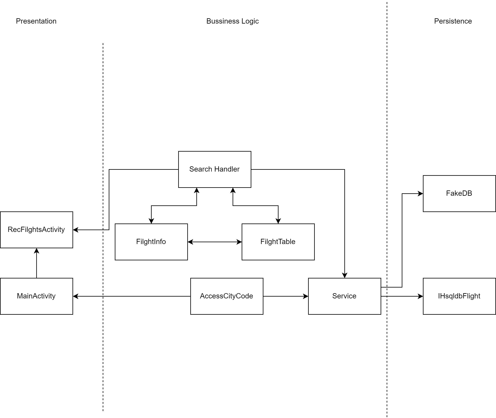

# Architecture Diagram

## Iteration 3 Diagram

## Iteration 2 Diagram

## Iteration 1 Diagram

 

## Presentation Layer

[MainActivity](https://code.cs.umanitoba.ca/winter-2022-a01/group-4/team-flight-4/-/blob/development/flight/app/src/main/java/com/flight/presentation/MainActivity.java)

This file contains the UI layout that user enters TRIPTYPE, DEPATURE and ARRIVAL CITY, DATES OF TRAVEL, and the number of travllers either adults or children or both. Once enter also click SEARCH button.

[RecFlightsActivity](https://code.cs.umanitoba.ca/winter-2022-a01/group-4/team-flight-4/-/blob/development/flight/app/src/main/java/com/flight/presentation/RecFlightsActivity.java)

This file open a new flight activity containing travellers flight options and adds ability to reserve a certain flight.

[RecFlightsAdapter](https://code.cs.umanitoba.ca/winter-2022-a01/group-4/team-flight-4/-/blob/developmentClean/flight/app/src/main/java/com/flight/presentation/RecFlightsAdapter.java)

This file provides an adapter to show the flights list view.

[RecViewInterface](https://code.cs.umanitoba.ca/winter-2022-a01/group-4/team-flight-4/-/blob/developmentClean/flight/app/src/main/java/com/flight/presentation/RecViewInterface.java)

This file provides an interface for reservationForm.

[ReservationFormActivity](https://code.cs.umanitoba.ca/winter-2022-a01/group-4/team-flight-4/-/blob/developmentClean/flight/app/src/main/java/com/flight/presentation/ReservationFormActivity.java)

This file open a new activity to show the flight information and then users can reserve the flight.

## Business Logic Layer

[AccessCityCode](https://code.cs.umanitoba.ca/winter-2022-a01/group-4/team-flight-4/-/blob/development/flight/app/src/main/java/com/flight/business/AccessCityCode.java)

This class is for getting the city name and code from the database.

[FlightTable](https://code.cs.umanitoba.ca/winter-2022-a01/group-4/team-flight-4/-/blob/development/flight/app/src/main/java/com/flight/business/FlightTable.java)

This class is for getting a flight table.

[FlightInfo](https://code.cs.umanitoba.ca/winter-2022-a01/group-4/team-flight-4/-/blob/development/flight/app/src/main/java/com/flight/business/FlightsInfo.java)

This class is to define what info is in the flight.

[SearchHandler](https://code.cs.umanitoba.ca/winter-2022-a01/group-4/team-flight-4/-/blob/development/flight/app/src/main/java/com/flight/business/SearchHandler.java)

This class is a handler for presentation layer to search flights with specific conditions.

[ResInfo](https://code.cs.umanitoba.ca/winter-2022-a01/group-4/team-flight-4/-/blob/developmentClean/flight/app/src/main/java/com/flight/business/ResInfo.java)

This class is to get or save reservation information from or into the database.

[ResSearchHandler](https://code.cs.umanitoba.ca/winter-2022-a01/group-4/team-flight-4/-/blob/developmentClean/flight/app/src/main/java/com/flight/business/ResSearchHandler.java)

This class is a handler for presentation layer to search reservation with e-mail.

## Application Layer

[Services](https://code.cs.umanitoba.ca/winter-2022-a01/group-4/team-flight-4/-/blob/development/flight/app/src/main/java/com/flight/application/Services.java)

This class is to deal with the persistence layer for AccessCityCode and SearchHandler.

[Main](https://code.cs.umanitoba.ca/winter-2022-a01/group-4/team-flight-4/-/blob/developmentClean/flight/app/src/main/java/com/flight/application/Main.java)

This class is to setup the database.

## Persistence Layer

[CityCodesStub](https://code.cs.umanitoba.ca/winter-2022-a01/group-4/team-flight-4/-/blob/developmentClean/flight/app/src/main/java/com/flight/persistence/CityCodesStub.java)

This class is to define a citycode array in the stub.

[FlightsStub](https://code.cs.umanitoba.ca/winter-2022-a01/group-4/team-flight-4/-/blob/developmentClean/flight/app/src/main/java/com/flight/persistence/FlightsStub.java)

This class is to define flights in the stub.

[IHsqldbCityCodes](https://code.cs.umanitoba.ca/winter-2022-a01/group-4/team-flight-4/-/blob/developmentClean/flight/app/src/main/java/com/flight/persistence/IHsqldbCityCodes.java)

This class is to define an interface of searching city codes.

[IHsqldbFlights](https://code.cs.umanitoba.ca/winter-2022-a01/group-4/team-flight-4/-/blob/development/flight/app/src/main/java/com/flight/persistence/IHsqldbFlights.java)

This class is to define an interface of searching flights.

[IHsqldbReservations](https://code.cs.umanitoba.ca/winter-2022-a01/group-4/team-flight-4/-/blob/developmentClean/flight/app/src/main/java/com/flight/persistence/IHsqldbReservations.java)

This class is to define an interface of searching reservations.

## HSQLDB

[FlightPersistenceHSQLDB](https://code.cs.umanitoba.ca/winter-2022-a01/group-4/team-flight-4/-/blob/development/flight/app/src/main/java/com/flight/persistence/hsqldb/FlightPersistenceHSQLDB.java)

This file is a DAO object to access flights from the database.

[CityCodePersistenceHSQLDB](https://code.cs.umanitoba.ca/winter-2022-a01/group-4/team-flight-4/-/blob/developmentClean/flight/app/src/main/java/com/flight/persistence/hsqldb/CityCodePersistenceHSQLDB.java)

This file is a DAO object to access city codes from the database.

[ReservationPersistenceHSQLDB](https://code.cs.umanitoba.ca/winter-2022-a01/group-4/team-flight-4/-/blob/developmentClean/flight/app/src/main/java/com/flight/persistence/hsqldb/ReservationPersistenceHSQLDB.java)

This file is a DAO object to access reservation from the database.

## Domain Specific Objects

[City](https://code.cs.umanitoba.ca/winter-2022-a01/group-4/team-flight-4/-/blob/development/flight/app/src/main/java/com/flight/objects/City.java)

The city object.

[CityCode](https://code.cs.umanitoba.ca/winter-2022-a01/group-4/team-flight-4/-/blob/developmentClean/flight/app/src/main/java/com/flight/objects/CityCode.java)

The citycode object.

[Flight](https://code.cs.umanitoba.ca/winter-2022-a01/group-4/team-flight-4/-/blob/developmentClean/flight/app/src/main/java/com/flight/objects/Flight.java)

The flight object.

[Reservation](https://code.cs.umanitoba.ca/winter-2022-a01/group-4/team-flight-4/-/blob/developmentClean/flight/app/src/main/java/com/flight/objects/Reservation.java)

The reservation object.

## Note 
This diagram is subject to change as project evolves.
