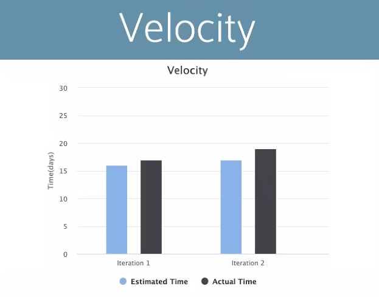

# Retrospective

## Discussion

As a group this project was a huge success since every team member assumed their roles and took full responsibility on completion of all tasks assigned to them helping in creating a fully functional android application.
The Canadian Airline Reservation System also met the minimum user interface success criteria that we set out at the beginning of the project. However, there were several places where we could have done better regarding the implementation of our ideas.

### Communication

First and for most out-communication skills could have used some improvement. An issue that arise was that not knowing the progress each team member was making on their assigned tasked. A solution to this would have been to create multiple personal branches, where team members would have uploaded their code regardless of completion. Our mistake was to upload only finished task. The solution we implemented was having regular meetings where each team member shared their project status.

### Time Management

Secondly, an issue that came up was time management. We underestimated the time it takes to complete most of the task which resulted in dropping features since we did not have time for completion. Multitasking was not efficient as it could have been during team meetings. During group meetings we worked on releases, worksheets, and retrospectives. We worked on them one at a time rather than distributing these documentations among certain team members and reviewing all of them in the meeting as a group. The strategy of meeting that we ha currently implemented made them last for longer than expected.

### Merge Request

Another issue that resulted with our branching strategy were merge conflicts whenever we wanted to merge our final iteration to main from development. Since we were all new to git therefore, we had minimal knowledge on how to execute proper merge request which resulted in inadvertent prudent technical debt. We solved these issues by research and constant time on git that made us familiar with the system. We feel like we are finally comfortable with merge conflicts in our last iteration after making multiple mistakes. If there were a proper documentation to follow regarding merge conflicts, it would have been a breeze to solve them compared to searching them on google and trying to match our personal scenario with theirs.

### Success

One of the successes of the final iteration will be evaluated based on a few things. Firstly, Merging proved to be a challenging task in iteration 2. So successfully merging the iteration 3 development early will help in keeping the team members more calm and less stressed. Second Full test coverage, iteration 2 we unknowingly submitted system tests as integration tests so having integration tests for this iteration 3 will prove to be beneficial as we will be able to test out seams. Thirdly continually Having detailed meetings logs since individually each team member can track their own personal and team progress. This will help keep others always informed regarding the progress of the project. Regardless of everything else the most important thing is everyone individually learned something, and they are happy with the project that we have built together.

## Project Velocity

