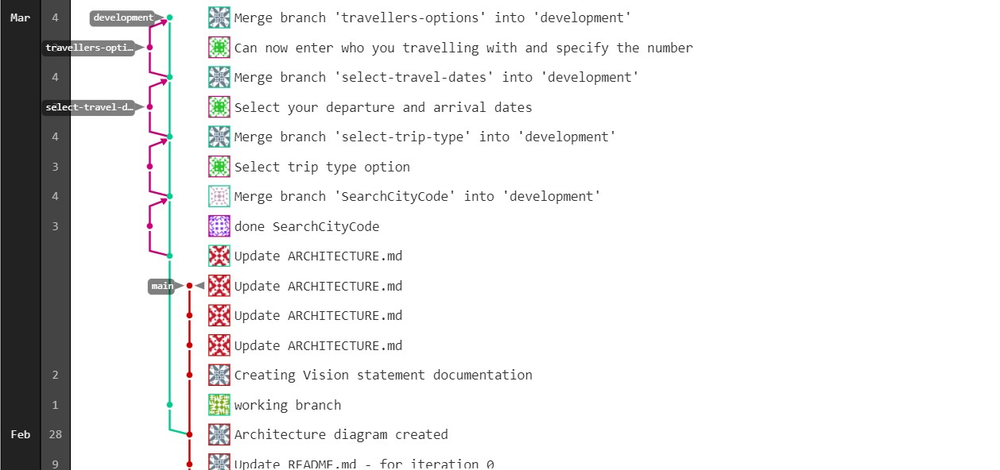

# Iteration 1 Worksheet

## Adding a feature

Feature Name: Airport City Codes (#1).
Aiport city code was broken down into two user stories: Select departure city (#11) and Select arrival city (#12).
One of the team members Xiaoran Xie implemented this feature by adding the search city codes in the business(logic) layer package. Then in the presentation layer he created the search input field with drop down view of canadian airport cities that the user can select. Then functionality was added so that user can select a specific city by typing in search input field for Arrival and Departure cities. Then the project was added to the SearchCityCode branch and was merged to development.

## Exceptional code

Currently there are not any thrown exceptions that are handled since our main focus was more on the UI area and completing a workable search page (# attach search page issue).

## Branching
Link to branching strategy (Git hub flow)(https://code.cs.umanitoba.ca/winter-2022-a01/group-4/team-flight-4/-/blob/main/Contributing.md#branches-details)

We are using a Github Flow branching strategy. First we clone all out projects than we upload to a developement branch where group members are working on their own feature. A working verison in than commited and pushed onto GitLab through development branch and merged to main after making a Merge Request on GitLab.

## SOLID

Find a SOLID violation in the project of group 5.
As of Now Group 5 app is not functional and only template is to be seen that does not violate Single Responsibility Principle.

## Agile Planning

Due to UI constraints we had to push unit testing for GUI to the next iteration. The Search page UI was thought to be simple until prototypes were created and got complicated eventually. Interface for the Search was important since that was one of the building blocks for the high priority features. That is why we chose to finish that first and we definetly downplayed the interface thinking it would be easy and can be done in less time but as we started designing on android studio the constraints the layout and everything got complicated.
