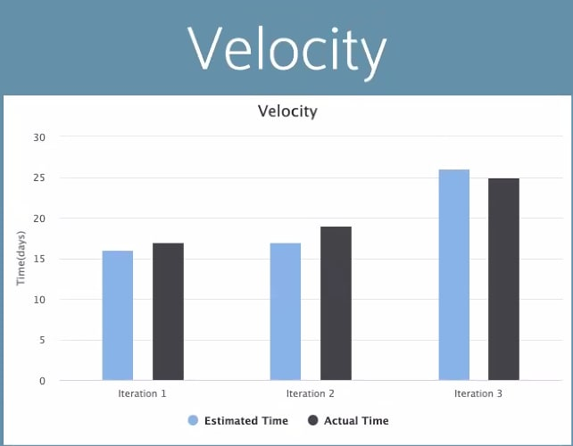

# Iteration 3 Worksheet

## What technical debt has been cleaned up

###### Instance 1: Checking if Form is filled

1. Paying it of by checking if the from inputs are filled by the user before searching for flights.
2. Commit link can be found [here](https://code.cs.umanitoba.ca/winter-2022-a01/group-4/team-flight-4/-/commit/6ef3653797f491647562cc03e363982451c0a48e).
3. This would be classified under _inadverent prudent_ because we did not know until we had an error and now we know how to solve it.

###### Instance 2: Using fake city codes database

1. We swtiched over to real database implementation
2. Commit link can be found [here](https://code.cs.umanitoba.ca/winter-2022-a01/group-4/team-flight-4/-/commit/05269c1c5dc76b848ba9a0db61c9083accedd427).
3. This would be classified under _deliberate reckless_ because we did not have time for design due to other issues.

## What technical debt did you leave?

Passing trip type to search handler so that we can return one way flights or two way flights. We dropped it because we were only accounting for round trip flights that required us to create another UI interface.
This would be classified under _deliberate prudent_ because we intentionally cut it off due to time constraints.

## Discuss a Feature or User Story that was cut/re-prioritized

###### Feature #6+

1. We cut this feature because it would have been time consuming to implement.
2. We cut it because our development design was different than we initially planned out and would not make sense to do it.

## Acceptance test/end-to-end

Refer to the link below.

Link to our Acceptance Test [here](https://code.cs.umanitoba.ca/winter-2022-a01/group-4/team-flight-4/-/blob/developmentClean/AcceptanceTest.md)
Link to our code simulation in Android studio [here](https://code.cs.umanitoba.ca/winter-2022-a01/group-4/team-flight-4/-/blob/MainClean/flight/app/src/androidTest/java/com/flight/presentation/MainActivityTest.java).

## Acceptance test, untestable

The flightPrices are random so they are non-deterministic values that are difficult to test.

## Velocity/teamwork

Our estimation for Iteration 3 improved compared to Iteration 1 and 2 where we underestimated task completion time.  Here is a graph comparing our estimated vs actual time spent on our tasks 

